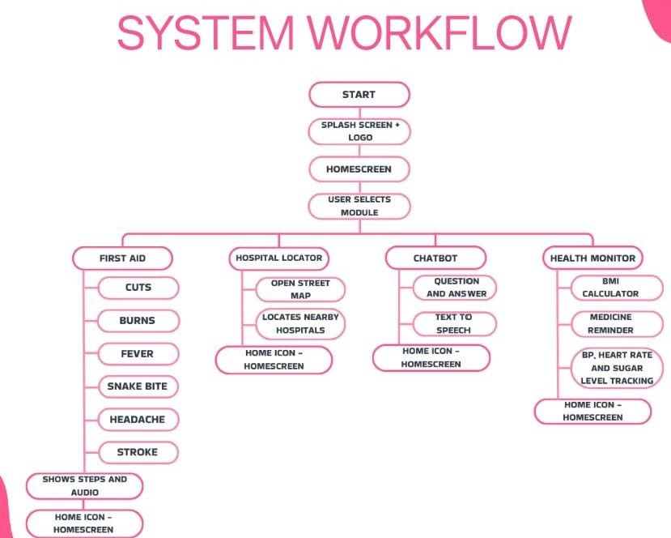

# AARUDHRA: Digital Bridge for Emergency Response in Rural Madurai
**Best poster award winner, ICISTEEH-26 (International Conference)**
## 🚀  Overview
AARUDHRA is a digital emergency response system designed to bridge the gap in emergency services for rural areas. It leverages low-latency communication and mobile technology to enable faster response in regions with limited infrastructure.
🏗️ System Workflow
I designed the following logic flow to ensure a seamless user experience during emergencies:
see: workflow.jpeg 
* ## 🧠 My Contribution: Idea Provider & System Architect
 **Conceptualization**: Engineered the end-to-end logic for a low-latency emergency response system.
 **Technical Defense**: Primary respondent for the technical Q&A, defending the architectural logic to a global panel of experts.
 
## 👥 The Team
* **Ms.CHANDANA V**: Project Concept, System Logic Design, and  Presentation.
* **Ms.SAHITHYA P**: Lead  Developer (Android/MIT App Inventor) and Presentation
* **Ms.FARJANA**: Data Collector and Prsentation.

*For a detailed look at the logic design, see [LOGIC_DESIGN.md](./LOGIC_DESIGN.md). For the full list of credits, see [CONTRIBUTORS.md](./CONTRIBUTORS.md).*

## 🔗 Collaboration & Implementation
This project was a collaborative effort. While I served as the **Architect & Logic Designer**, the technical development was led by my teammate.

* **Development Repository:** [sahithya-5508 / AARUDHRA](https://github.com/sahithya-5508/AARUDHRA)
* **Combined Contributor Insights:** [View Project Statistics](https://github.com/sahithya-5508/AARUDHRA/graphs/contributors)

*### 📚 Documentation & Research
The architectural logic of this project is supported by a formal research paper (presented at ICISTEEH-26).

* **View the Research Paper:** https://github.com/mvchad08-crypto/AARUDHRA-DIGITAL-BRIDGE-FOR-EMERGENCY-RESPONSE-IN-RURAL-MADURAI/blob/main/AARUDHRA_Research_Paper.pdf
* **Research & Data Sourcing:** Chandana V (via Secondary Research & Open-Source Intelligence)
* **Documentation Lead:** Sahithya P
